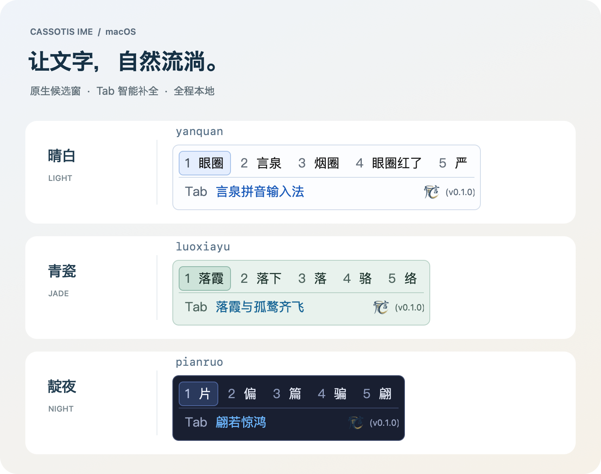

# Cassotis IME - 言泉输入法

<p align="center">
  
</p>

<p align="center">
  <a href="LICENSE"></a>
  <a href="COMPATIBILITY.md"></a>
  <a href="BUILD.md"></a>
</p>

<p align="center">
  
</p>

<p align="center"><sub>Native macOS candidate windows · Tab completion · Light, jade and dark themes</sub></p>

English | [简体中文](README.zh-Hans.md) | [繁體中文](README.zh-Hant.md)

Cassotis IME for macOS builds on the Windows and Linux versions and Cassotis Lexicon.

[Website](https://www.yanquan.org/mac) · [Downloads](https://github.com/shenmin/cassotis-ime-mac/releases) · [Windows](https://github.com/shenmin/cassotis-ime) · [Linux](https://github.com/shenmin/cassotis-ime-linux)

A native Chinese Pinyin input method for macOS, with an **InputMethodKit / AppKit frontend and a separate Free Pascal engine process**. The shared production engine follows Windows 1.27.0 and uses the Lexicon 1.27.0 dictionaries and the same local models. Future updates use the Windows version as their baseline.

Version **0.1.0** (build **1**) targets Apple Silicon. The deployment target is macOS 14+; release validation was performed on an M2 Pro running macOS 26.6.2. See [COMPATIBILITY.md](COMPATIBILITY.md) for the validation status of other systems and architectures.

## Features

- Full Pinyin, initial-letter abbreviations, and six Double Pinyin schemes: Microsoft, Xiaohe, Ziranma, Sogou, Ziguang, and Pinyin Jiajia.
- Simplified and traditional Chinese dictionaries, fuzzy Pinyin, partial candidate selection, long-sentence ranking, and local sentence repair.
- A fixed two-row candidate window: up to nine candidates on the first row, an always-present Tab completion row, and the logo and version at the bottom right. Learned words can be deleted using the small red × beside them.
- A native candidate window and settings interface, a single horizontal candidate row without wrapping, a default font size of 14 points, eight color options, and a live preview. The candidate window keeps focus in the application receiving input.
- A brief animated bubble beside the caret shows the Cassotis logo beside “中” (Chinese) or “英” (English), avoids nearby system cursor indicators, and appears when changing modes or switching from another input method to Cassotis. It dismisses when typing starts.
- Settings categories in a sidebar, font-name completion, and direct key recording for five configurable shortcuts. Confirmed choices save automatically; macOS system shortcuts and secure password fields retain their normal behavior.
- Joint local sentence repair with bilateral verification, repaired-prefix reuse for Tab completions, and stable candidates while typing or deleting incomplete initials.
- Correct Ziguang `sh` / `zh` / `ch` decoding (`song` / `zong` / `cong`), conservative diagnostics for invalid Pinyin and repeated vowels, with red error ranges in the candidate footer, and simplified/traditional display of shared learned words.
- Five-syllable decoding, stricter pronunciation checks for cached paths, and prefix ranking that respects repeated choices.
- When no predictive hint is available, Tab can join exact words for the already typed Pinyin. Predictive hints use the theme accent color; exact joins use ordinary text color.
- All inference runs locally on the CPU through ONNX Runtime. The installed input method needs no compiler, Python installation, or online service.

## Install and Try

Download the DMG, open it, double-click **安装言泉输入法** (Install Cassotis IME), and click **安装** (Install). When installation finishes, click **打开键盘设置** (Open Keyboard Settings). In System Settings, go to **Keyboard → Text Input → Edit → + → Chinese, Simplified** and add **言泉输入法**. Select it from the input menu in the menu bar. If the input source is already added, select it directly; the menu displays the color Cassotis logo when it is active. Type `nihao` and press Space to enter “你好”.

The graphical installer shows progress, preserves settings and learned words during upgrades, and provides logs and a retry option if installation fails. Using the installed input method requires no Terminal commands, compiler, Python installation, or separate model downloads. Packages ending in `-local` use a local ad hoc signature; packages ending in `-signed` use a Developer ID signature. Neither type of test package has been notarized by Apple. The installer also provides an uninstall option; remove the input source in System Settings first.

## Build and Install

Development requires **Free Pascal 3.2.2, Xcode command-line tools, and Python 3.11+**. Lazarus/LCL is not required. Obtain the generated assets from [Cassotis Lexicon v1.27.0](https://github.com/shenmin/cassotis-lexicon/tree/v1.27.0) and point `CASSOTIS_LEXICON_ROOT` to your checkout (`/path/to/...` is a placeholder):

```sh
export CASSOTIS_LEXICON_ROOT="/path/to/cassotis-lexicon"
./build_all.sh
./install.sh
```

The application is built at `build/arm64/Cassotis.app` and installed to `~/Library/Input Methods/Cassotis.app`. Add 言泉输入法 under System Settings → Keyboard → Text Input, then select it from the input menu. If the input-source list does not refresh, log out and log back in.

By default, Shift switches between Chinese and English input, Space or a number selects a candidate, Tab accepts a completion, and Ctrl+Shift+F10 opens settings. See [CONFIGURATION.md](CONFIGURATION.md) for the full key bindings and data locations.

`./rebuild_all.sh` cleans the build output and performs a complete rebuild. `./uninstall.sh` removes the current user's input method while preserving learned words. See [BUILD.md](BUILD.md) for build prerequisites, model downloads, dictionary imports, packaging, and signing. Builds use a local ad hoc signature by default.

## Validation and Benchmarks

Release validation covers core behavior, model execution, dictionary imports, IPC, composition, recovery and settings persistence, along with real input in native text controls, WebKit, Chrome, Electron and Terminal.

The upgrade passes 460 core regressions and 2,448 simplified/traditional dictionary cases. Full corpus benchmarks meet the frozen Windows v1.27.0 count limits: long-sentence Top1/Top2 are **11,969 / 12,955** (−9 / +0), context-enabled short words are **61,860 / 63,549**, and short-word Tab completion has **9,420** hits (+1). Both long-completion budgets pass; the 50 ms production track records **429** predictive hits, **6,765** predictive prompts, and **980** net keys saved. Exact joins of already typed Pinyin are counted separately. See [BENCHMARK.md](BENCHMARK.md) for methods, timings and scope. Test programs, desktop automation, benchmark tools, corpora, and per-case diagnostics are not included in the source distribution.

## Source and License

`src/macos` contains the native frontend, `src/service` / `src/ipc` implement the process protocol, `src/engine` / `src/dictionary` contain the shared production core, and `src/host` hosts the local models. See the [architecture document](docs/ARCHITECTURE.md) for module details. Model/schema checksums and lexicon input hashes are in `data/runtime-assets.sha256` and `data/lexicon-inputs.json`; licenses and provenance are described in [NOTICE.md](NOTICE.md). Application code is licensed under GPL-3.0, and the dictionaries use the upstream CC BY-SA 4.0 license.
