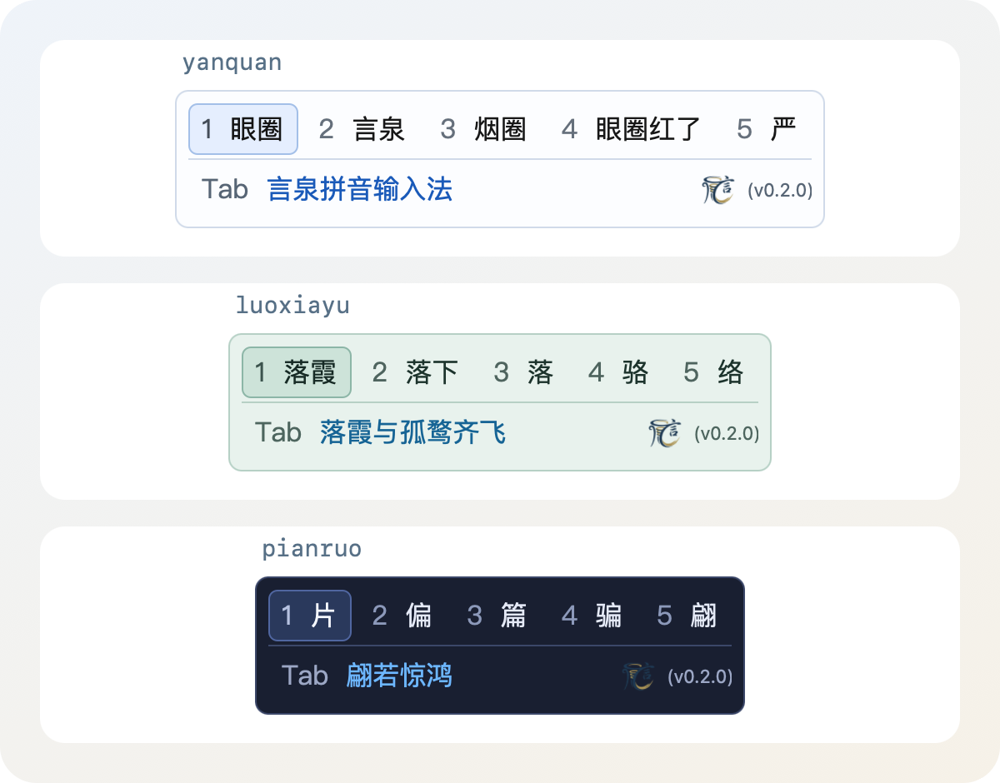

# Cassotis IME - 言泉輸入法

<p align="center">
  
</p>

<p align="center">
  <a href="LICENSE"></a>
  <a href="COMPATIBILITY.md"></a>
  <a href="BUILD.md"></a>
</p>

<p align="center">
  
</p>

<p align="center"><sub>macOS 原生候選視窗 · Tab 補全 · 晴白、青瓷與靛夜主題</sub></p>

[English](README.md) | [簡體中文](README.zh-Hans.md) | 繁體中文

Cassotis IME - 言泉輸入法是一款面向 macOS 的開源中文拼音輸入法，提供原生候選視窗、本機語言模型與儲存在本機的使用者詞學習。

[官網](https://www.yanquan.org/mac) · [下載安裝套件](https://github.com/shenmin/cassotis-ime-mac/releases) · [Windows](https://github.com/shenmin/cassotis-ime) · [Linux](https://github.com/shenmin/cassotis-ime-linux)

採用 **InputMethodKit / AppKit 前端與 Free Pascal 獨立引擎處理程序**，融入 macOS 原生文字輸入。詞庫與模型隨套件提供，候選排序、句子修正及 Tab 補全皆在本機完成。

版本 **1.0.0**（build **3**），支援 Apple Silicon 與 macOS 14 及以上。已驗證範圍與已知限制請見 [COMPATIBILITY.md](COMPATIBILITY.md)。

## 主要功能

- 全拼、簡拼，以及微軟／小鶴／自然碼／搜狗／紫光／拼音加加六種雙拼方案。
- 簡體與繁體詞庫、模糊拼音、分段選詞、長句排序與本機句子修正。
- 預設兩行候選視窗，可選翻頁時展開三行候選：每行最多九項，始終保留 Tab 補全行，右下顯示 logo 與版本；使用者詞可點選旁邊的小紅 × 刪除。
- 原生候選視窗與設定介面，候選項橫排不換行、預設 14 點字級、八種配色選項與即時預覽；候選視窗不會搶走輸入焦點。
- 切換中英文或從其他輸入法切入言泉時，在游標旁以短暫的動畫氣泡顯示言泉 logo 與「中」或「英」，並避開附近的系統游標標誌；開始輸入後自動收起。
- 左側分類設定、字體名稱補全，以及可直接按鍵錄製的五項快捷鍵；確定選項後自動儲存，保留 macOS 系統組合鍵與安全密碼欄位的正常行為。
- 聯合局部修正與雙向複核，Tab 補全重用已驗證的前綴修正；輸入或退格至未完成聲母時保持候選穩定。
- 修復紫光 `sh` / `zh` / `ch` 的音節解析，保守判斷異常拼音與重複母音，在候選窗底部以紅色標出錯誤範圍；共用使用者詞依簡繁模式轉換顯示。
- 改進五音節解碼、快取路徑的精確讀音檢查，以及重複選擇後的前綴排序。
- 沒有預測提示時，Tab 可精確拼接已輸入拼音對應的詞；預測提示使用主題強調色，精確拼接使用一般文字色。
- 共用字符級語言模型統一改善長句、上下文短詞、混合簡拼與 Tab 續寫，保留使用者學習和精確整詞保護。
- Tab 同時比較當前詞補全、後續片語與下一個字建議；短詞先顯示詞庫結果，再於背景重排，保護明確的拼音音節邊界。
- 新增專業詞精確輸入，多音字補充讀音不重複累計文字熱度；共用模型編碼與拼音快取減少計算。
- 所有推論皆在本機透過 CPU ONNX Runtime 執行；安裝後不需要編譯器、Python 或網路服務。

## 安裝與試用

一般使用者下載並開啟 DMG，按兩下其中的「言泉输入法安装器」，再點選「安装」。安裝程式會自動請求啟用；若 macOS 顯示確認視窗，請點選「允許」。顯示「安装完成」後，直接從選單列的輸入選單選用「言泉输入法」，選取時會顯示彩色言泉 logo。輸入 `nihao` 後按空白鍵，即可試打「你好」。若尚未啟用，可點選「重试启用」，或透過「打开键盘设置」手動加入。

macOS 27 可能只開啟鍵盤設定而未顯示確認視窗。請在「文字輸入 → 編輯 → + → 中文（簡體）」中加入「言泉输入法」，再返回安裝程式；安裝程式會自動核實啟用狀態。

圖形安裝程式會顯示進度，升級時保留設定與學習紀錄，失敗時提供記錄檔與重試選項。使用時不需要終端機、編譯器、Python 或另外下載模型。v1.0.0 下載檔案為 `cassotis-ime-macos-1.0.0-arm64-installer-signed.dmg`，已使用 Sunisoft Limited 的 Developer ID 簽章並完成 Apple 公證。檔名帶有 `-local` 的本機開發套件使用臨時簽章。安裝程式也提供解除安裝功能；請先從系統設定移除輸入來源。

## 基準測試

以下使用相同的完整語料，比較 macOS v1.0.0 與前一版 v0.2.0。表中的版本號均為 macOS 產品版本。

測試方法、評分規則與詳細結果請見 [BENCHMARK.md](BENCHMARK.md)。語料來自開發者自己的小說著作 [《永恆的舞動》](https://www.qidian.com/book/1037259117/)。

兩版均在 Apple M2 Pro、32 GiB 記憶體上以原生 arm64 程式測量：v1.0.0 使用 macOS 27.0.1，v0.2.0 使用 macOS 27.0。以下保留各版發行時的實測耗時，並非將兩版在目前系統重新執行。

### Cassotis 長句語料基準測試-16300

| macOS 版本 | Top1 | Top2 | 平均 (ms) | P50 (ms) | P95 (ms) | 最大 (ms) |
| --- | --- | --- | --- | --- | --- | --- |
| `v1.0.0` | **12,941/16,300 (79.39%)** | **13,534/16,300 (83.03%)** | 85.043 | 79 | 148 | 567 |
| `v0.2.0` | 11,989/16,300 (73.55%) | 12,968/16,300 (79.56%) | 59.615 | 54 | 115 | 452 |

### 短詞上下文基準測試-65000

| macOS 版本 | Top1 | Top2 | 競爭詞 Top1 | 競爭詞 Top2 | 平均 (ms) | P50 (ms) | P95 (ms) | 最大 (ms) |
| --- | --- | --- | --- | --- | --- | --- | --- | --- |
| `v1.0.0` | **63,036/65,000 (96.98%)** | **64,103/65,000 (98.62%)** | **10,488/11,728 (89.43%)** | **11,196/11,728 (95.46%)** | 6.801 | 6 | 17 | 40 |
| `v0.2.0` | 61,974/65,000 (95.34%) | 63,568/65,000 (97.80%) | 9,677/11,728 (82.51%) | 10,776/11,728 (91.88%) | 5.971 | 4 | 16 | 63 |

「競爭詞」是同一拼音對應至少兩個目標詞的 11,728 例子集，用於衡量結合前文進行同音選詞的效果。

### 一鍵補全上下文基準測試-12831

| macOS 版本 | 補全命中率 | 平均節省按鍵 | 逐鍵穩定率 | 按鍵 P95 (ms) | 最終顯示 P95 (ms) |
| --- | --- | --- | --- | --- | --- |
| `v1.0.0` | **10,331/12,831 (80.52%)** | 2.638 | **2,117/2,180 (97.11%)** | 1.213 | 9.385 |
| `v0.2.0` | 9,420/12,831 (73.42%) | 2.548 | 1,691/1,749 (96.68%) | 1 | 1 |

平均節省按鍵按每次正確補全計算，已扣除接受補全的一次按鍵；逐鍵穩定率只統計繼續輸入後原補全仍相容的機會。v1.0.0 合計淨節省 27,250 鍵，v0.2.0 為 24,006 鍵。

v1.0.0 新增背景語言模型重排：按鍵 P95 不包含重排，最終顯示 P95 在提示改變時計入重排耗時。v0.2.0 沒有背景重排，兩項數值相同；舊版補全計時精度為整數毫秒，新版以微秒取樣後換算為毫秒。

### Cassotis 長句一鍵補全基準測試-16300

每條長句保留末尾四個拼音音節不輸入，評估介面顯示的唯一續寫。正確結果須擴展已輸入的目標前綴，並仍是參考句的前綴。覆蓋率僅統計預測提示，不含已輸入拼音的精確拼接，也不代表提示準確率。

| macOS 版本 | 局部續寫命中率 | 預測提示覆蓋率 | 總節省按鍵 | P95 (ms) |
| --- | --- | --- | --- | --- |
| `v1.0.0` | **3,539/16,300 (21.71%)** | 15,812/16,300 (97.01%) | **7,539** | 131 |
| `v0.2.0` | 450/16,300 (2.76%)<br>*425/16,300 (2.61%)* | 6,778/16,300 (41.58%) | 1,024<br>*988* | 86 |

macOS v1.0.0 起，長句補全評分將相同位置的「他/她」視為等價。v0.2.0 的一般數字由保存的 16,300 條結果按新規則重評，斜體保留原始嚴格規則；沒有重新執行舊版引擎，覆蓋率與耗時保持原實測值。短詞補全和逐鍵穩定性仍採用嚴格比對。

長句補全正式執行的結果預算分別為 v1.0.0 的 80 ms、v0.2.0 的 50 ms，不等於完整查詢耗時上限。表中延遲為引擎查詢或補全過程耗時，不含模型冷啟動、InputMethodKit/IPC、候選視窗繪製及實際按鍵間隔，不能視為端到端輸入延遲。

測試程式、基準工具、語料與逐例報告不隨公開原始碼分發。

發行驗證涵蓋 600 項核心回歸、2,840 條簡繁詞庫案例、模型執行、IPC、組字復原與設定儲存，以及原生文字控制項、WebKit、Chrome、Electron 和 Terminal 中的實際輸入。

## 建置與安裝

開發需要 **Free Pascal 3.2.2、Xcode 命令列工具與 Python 3.11+**，不依賴 Lazarus/LCL。準備 [Cassotis Lexicon v1.31.0](https://github.com/shenmin/cassotis-lexicon/tree/v1.31.0) 的產生資產，將 `CASSOTIS_LEXICON_ROOT` 指向自己的詞庫目錄（`/path/to/...` 為佔位路徑）：

```sh
export CASSOTIS_LEXICON_ROOT="/path/to/cassotis-lexicon"
./build_all.sh
./install.sh
```

應用程式輸出至 `build/arm64/Cassotis.app`，安裝至 `~/Library/Input Methods/Cassotis.app`。從「系統設定 → 鍵盤 → 文字輸入」加入「言泉输入法」，再透過輸入選單啟用。如果系統清單尚未更新，可登出後重新登入。

預設以 Shift 切換中英文、空白鍵或數字鍵選取候選、Tab 接受補全，並以 Ctrl+Shift+F10 開啟設定。完整按鍵與資料位置請見 [CONFIGURATION.md](CONFIGURATION.md)。

`./rebuild_all.sh` 會清理建置輸出並完整重建；`./uninstall.sh` 會解除安裝目前使用者的輸入法並保留學習紀錄。建置環境、模型下載與詞庫匯入說明請見 [BUILD.md](BUILD.md)。預設建置使用本機臨時簽章，封裝與簽署方式也請見建置文件。

## 原始碼與授權

引擎衍生自 [Cassotis IME Windows 版](https://github.com/shenmin/cassotis-ime)，Free Pascal 移植基礎與 [Linux 版](https://github.com/shenmin/cassotis-ime-linux) 共用。macOS 1.0.0 納入 Windows 1.31.0 的引擎改進，使用 [Cassotis Lexicon 1.31.0](https://github.com/shenmin/cassotis-lexicon) 詞庫與模型；共用引擎的後續更新繼續跟進 Windows。macOS 版獨立維護原生介面、產品發行與基準歷史。

`src/macos` 是原生前端，`src/service` / `src/ipc` 提供處理程序通訊協定，`src/engine` / `src/dictionary` 為共用的正式核心，`src/host` 負責承載本機模型。模組說明請見[架構文件](docs/ARCHITECTURE.md)。模型/schema 校驗值與詞庫輸入雜湊值分別位於 `data/runtime-assets.sha256` 和 `data/lexicon-inputs.json`，授權與來源請見 [NOTICE.md](NOTICE.md)。應用程式碼採用 GPL-3.0，詞庫採用上游聲明的 CC BY-SA 4.0。
