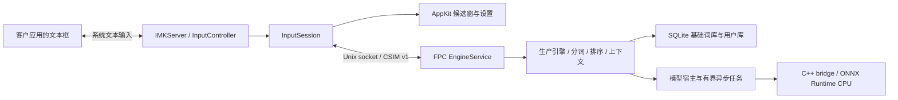

# macOS 实现架构

版本 0.1.0，使用原生 InputMethodKit / AppKit 前端和 Free Pascal 独立引擎。

## 模块和进程

`Cassotis.app/Contents/MacOS/Cassotis` 是 Objective-C++ 前端，`cassotis-engine` 是 Free Pascal helper。两个进程通过协议版本固定的 Unix socket 通信。基础词库、模型和运行库在 bundle 内；用户词库和设置在 Application Support，日志在 Library/Logs。

| 源码 | 职责 |
| --- | --- |
| `src/macos/main.mm` | 输入源服务器、IMK 控制器、生命周期与菜单 |
| `src/macos/InputSession.mm` | 系统事件、组合/提交、上下文、恢复与 helper 管理 |
| `src/macos/EngineClient.*` | 固定宽度二进制 codec、严格 UTF-8、请求和 generation 验证 |
| `src/macos/CandidatePanel.mm` | 非激活候选窗、补全行、分页、点击和用户词删除 |
| `src/macos/InputModePanel.mm` | 光标旁的中英文状态气泡、动画、自动收起及安全输入保护 |
| `src/macos/SettingsController.mm` | 行为设置、快捷键校验与原生显示偏好 |
| `src/service` / `src/ipc` | socket、连接上下文映射、dispatcher 和生产服务 |
| `src/engine` / `src/dictionary` | Windows/Linux 生产算法、生成模型、SQLite 和学习 |
| `src/host` | 本地模型宿主、队列、修正/补全和 C++ ONNX 桥接 |
| `tools/dictionary` | 移植后的 Windows 正式词库导入器 |

## 会话、文本和事件

每个活动 IMK 会话拥有一条连接。新控制器激活时先结束上一活动会话的组合，保证共享引擎在旧分段提交完成之后才切换上下文；失活时关闭连接。迟到的普通 keyUp 不会重新激活旧控制器。

组合区保存“已确认汉字＋剩余原始输入”。引擎供查询和重放使用的 composition 仍是剩余拼音，避免用已转换汉字再做拼音解析。Space 可以只确认一个分段；IMK 提交屏障循环确认剩余分段，并防止重复上屏。Escape 清除当前组合，Enter 沿用引擎原文提交语义。

普通 keyUp 不发给引擎。Shift 单键通过 flagsChanged 的按下/释放配对处理；参与 Command、Fn、其他修饰组合或鼠标操作时取消单键手势。Command、系统输入源快捷键、未配置的 Option 布局字符和死键透传。明确配置的 Option 快捷键使用不含 Option 变换的布局字符匹配。Mac 虚拟键转换覆盖方向、翻页、F1–F20 和数字键盘符号。

上下文限制为光标前最多 1,024 个 UTF-16 单元，避免从低代理项开始；读取不可用或发生异常时使用空上下文。初始标记区、提交与插入位置均使用 IMK 客户端协议。密码框由系统安全输入机制处理，不采集其文本。

候选窗通过 `attributesForCharacterIndex:0 lineHeightRectangle:` 查询组合串起点；该索引相对于当前 inline session，不能使用文档绝对 `selectedRange.location`。返回的行矩形采用 AppKit 全局屏幕坐标，允许零宽光标，按锚点所属屏幕的 `visibleFrame` 放置。下方空间不足时从整行上方留出 8 点间距，右侧空间不足时向左收进屏幕。候选和补全固定为两行，按字体度量预留高度，补全内容变化不改变高度。空矩形及非有限坐标不会覆盖原有备用位置。

候选视图保留原始 comment 给引擎校验和分段提交，显示时按 Windows 规则隐藏纯 ASCII 拼音后缀。首行最多九项，按自然宽度和剩余空间分配宽度，过长内容省略。小红 × 独立命中，视觉为 10 点、点击宽度为 22 点；第二行常驻补全和品牌区。

状态气泡与候选窗共用光标查询，分别做屏幕边界布局。没有组合串时，IMK 的索引 0 表示当前选区位置。气泡为 64×40 点的非激活、鼠标穿透面板，使用候选配色，将 16 点彩色 logo 放在引擎确认的 13 点“中”或“英”左侧。激活时复用已有状态读取；只有配置的模式键额外读取切换后状态，普通输入不增加 RPC。光标尚未就绪时最多重试 0.4 秒；开始输入、出现组合串、切离或恢复连接均取消提示。Core Animation 实现淡入及轻微缩放，0.85 秒后淡出，开启减少动态效果时不缩放；定时器使用弱引用和代次检查，快速切换不会被旧定时器提前隐藏。安全输入、无效或屏外光标不显示气泡，也不退回鼠标位置。

状态气泡默认在光标上方，为通常位于下方的系统标识预留空间。系统光标附件常由当前应用的浮动窗口托管；使用 `CGWindowListCopyWindowInfo` 读取光标附近的小型浮动窗口边界、所属进程与层级，不读取窗口标题或图像，也不请求录屏或辅助功能权限。每 60 毫秒仅在气泡显示期间检查一次，避开稍晚出现、展开或翻到光标上方的标识；当前位置仍安全时保持不动，避免系统动画收起时来回跳动。找不到窗口元数据时保留默认上方布局；没有可容纳气泡且避开光标和附件的位置时收起提示。

设置使用原生 NSComboBox 数据源完成字体前缀定位与补全，确认时规范化字体名称，无效值回退。确认控件调用统一验证及持久化路径，失败恢复上次保存状态并内联显示原因；未完成的字体输入只更新预览，关闭不弹出保存对话框。

## IPC 与恢复

协议头是 44 字节小端 CSIM v1.0，字段包含类型、标志、request/context/generation 和 payload 长度。一个前端连接固定外部 context 1，服务端分配独立内部 ID。字符串最多 1 MiB、payload 最多 8 MiB，严格检查长度、UTF-8、保留字段、枚举和候选页范围。

state schema 5 保留 schema 4 的 36 字节前缀，追加禁用快捷键位和保留字节，总计 40 字节；前端兼容读取 schema 4/5，服务保留更早的解码。用户库使用独立 disabled mask 持久化五个快捷键的禁用状态。

所有修改请求推进 generation；读取状态和轮询保留 generation。所有上下文请求（包括异步轮询）都经过连接的内外 ID 映射。异步结果只应用到同一 context/generation，普通按键释放不会作废对应按下产生的补全任务。

候选点击和小红 × 验证视图仍属于当前内容；删除菜单携带候选视图版本，拒绝刷新前排队的旧操作。新增消息 18 `remove_candidate`：schema 1、int32 页内索引、query / text / comment 三个 UTF-8 字符串。服务再次核对当前身份和用户词属性，直接调用删除接口，不模拟 Ctrl+Delete，因此用户改键不会改变右键菜单的语义。异步补全是否可以挑战已有静态补全由核心判定，服务不再以“补全行非空”额外阻止请求。

同步请求设有 1,000 ms 故障上限，该值不是正常输入延迟目标。超时或异常会断开连接、保留并提交最后可见组合，将当前按键交给客户应用；不重放结果不确定的请求。管理器终止自己启动的故障 helper 并允许重启。管理模式 helper 带父 PID，在启动者退出后自动清理 socket 并退出。

helper 在输入源启动时提前启动。socket 尚未连接时，前端最多暂存 64 个普通拼音及相关编辑/选择按键，并立即显示临时组合串；25 ms 定时器在连接后按顺序回放，更新连续提交之间的上下文。捕获上下文早于临时组合串插入，避免把拼音当作左侧正文。两秒连接期限、焦点切换或不支持的按键触发原文恢复；清空队列早于客户端回调，防止重入时重复提交。已经发送而结果未知的请求仍不重放。Unix socket 位于系统私有临时目录，检查所有权和权限，使用锁文件防止双服务，Darwin 使用 SO_NOSIGPIPE。

## 算法、模型与资源

核心对齐 Windows 1.25.0 / Linux 0.7.0，保留 Linux 的 FPC 适配与 macOS 的组合串语义。预测前缀准入由 `nc_prefix_completion_policy` 管理，候选快照和导航稳定性由 `nc_candidate_presentation` 管理；鼻音边界、已确认后缀、短复合词上下文证据、ü 别名和冷启动分页均有独立回归。共享轻量排序的两个局部缓存标志在入口显式初始化。

模型参数和六个 ONNX 图与 Windows 1.25.0 的部署资产相同，ORT 1.20.1 固定 CPU 执行、量化精度配置和线程/内存策略。生产补全结果预算为 50 ms，局部修正为 30 ms；主排序器的 30 ms 仅记录审计，保留已经同步算出的结果，与 Linux 宿主一致。没有引入云端、GPU/CoreML 执行器或重新训练。

`nc_runtime_paths` 统一解析 bundle 内的运行资源路径，三个模型宿主在实际加载文件时使用该解析器。输入法前端以 `cassotis-engine --serve` 启动服务，传入基础词库、用户词库、socket 和父进程参数；`--version` 用于读取引擎版本。

基础数据库只读，用户数据库使用独立可写路径。Lexicon 1.25.0 的 24 个输入通过 schema 24 导入器重建简繁两库，完整保留 query paths、转移、补全竞争/审计和正反字符语言模型；模型与 schema 的 SHA-256 在 `data/runtime-assets.sha256`，词库生成输入校验值在 `data/lexicon-inputs.json`。

平台时钟统一为 mach_absolute_time，避免 FPC 默认 Darwin 计时发生系统时钟回退；性能频率由 mach_timebase_info 获取。

## 构建和安装

`scripts/build.sh` 检查编译环境与资产，依次构建 C++、FPC、词库和应用，并由内向外签名。调试符号保存在构建目录，不把 dSYM 放入应用可执行文件目录。安装器先验证暂存副本，再结束输入、备份和替换已安装 bundle，失败可回退。

评分方法、测量范围与汇总结果见 [BENCHMARK.md](../BENCHMARK.md)。
